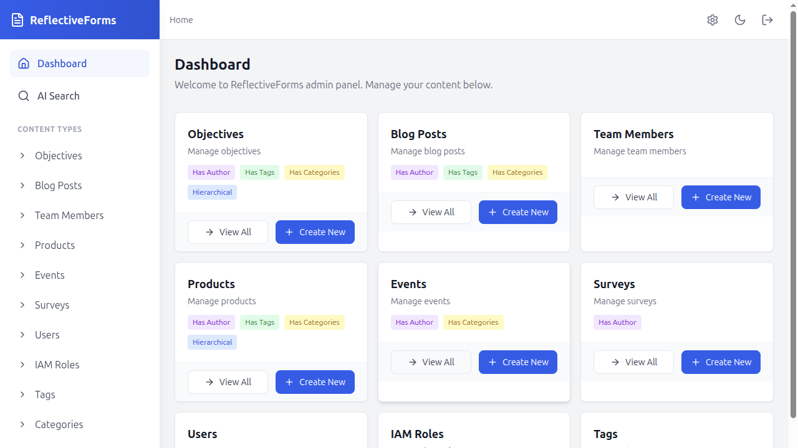
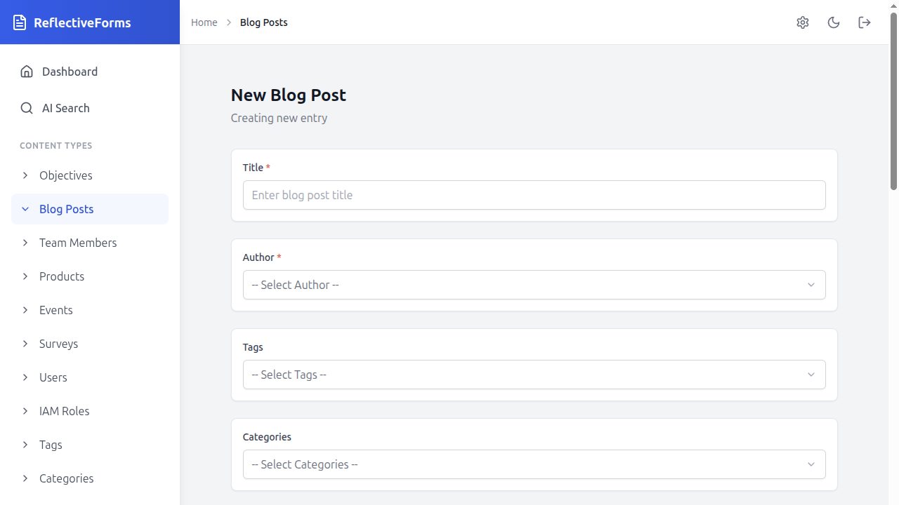

# Getting Started with ReflectiveForms

This guide walks you through building your first admin panel with ReflectiveForms. By the end, you'll have a working backend API and a React frontend that lets you create, edit, and manage entities — all generated from simple C# model classes.

## What You'll Build

A "Notes" admin panel where you can:
- Create and edit notes with a rich text editor
- Set priority levels (low / medium / high)
- Pin important notes
- Search, sort, and paginate through your notes

No frontend code needed — just define a C# class and ReflectiveForms handles the rest.

---

## Prerequisites

| Tool | Version | Check |
|------|---------|-------|
| .NET SDK | 8.0+ | `dotnet --version` |
| Node.js | 18+ | `node --version` |
| npm | 9+ | `npm --version` |

---

## Option A: Use the CLI Scaffolder (Fastest)

```bash
npx @reflective-forms/create-app my-notes-app
```

Answer the prompts (or press Enter to use defaults):

```
Project name: my-notes-app
Display name: My Notes App
Primary color: #2563eb
Backend port: 9000
Frontend port: 3000
```

Then start it up:

```bash
cd my-notes-app

# Terminal 1 — start the backend
cd backend
dotnet run

# Terminal 2 — start the frontend
cd frontend
npm install
npm run dev
```

Open http://localhost:3000 and log in with `admin@karasoftware.com` / `123456`. You'll see a "Notes" section in the sidebar — that's your first entity, ready to use.


*The admin dashboard auto-generates from your entity registrations — no frontend code required*

**Skip to [Understanding Your Entity Model](#understanding-your-entity-model) to learn how it works.**

---

## Option B: Set Up Manually

### Step 1: Create the Backend

Create a new .NET project:

```bash
mkdir my-notes-app && cd my-notes-app
mkdir backend && cd backend
dotnet new web
dotnet add package ReflectiveForms.Core
```

Replace `Program.cs` with:

```csharp
using System.Net;
using ReflectiveForms.Core;

var builder = WebApplication.CreateBuilder(args);

builder.Services.AddCors(options =>
{
    options.AddPolicy("Frontend", policy =>
    {
        policy.WithOrigins("http://localhost:3000")
              .AllowAnyMethod()
              .AllowAnyHeader()
              .AllowCredentials();
    });
});

builder.WebHost.ConfigureKestrel(options =>
{
    options.Listen(System.Net.IPAddress.Any, 9000);
});

// Create rf logger
using var loggerFactory = LoggerFactory.Create(logging =>
{
    logging.AddConsole();
    logging.AddDebug();
});
var rfLogger = loggerFactory.CreateLogger<Program>();

var app = builder.BuildWithReflectiveFields(RfBuilder.Build(rfLogger));
app.UseCors("Frontend");
app.Run();
```

Create `RfBuilder.cs`:

```csharp
using CrossCloudKit.Database.Basic;
using CrossCloudKit.File.Basic;
using CrossCloudKit.Memory.Basic;
using CrossCloudKit.PubSub.Basic;
using Microsoft.Extensions.Logging;
using ReflectiveForms.Core;
using ReflectiveForms.Core.Endpoints;

public static class RfBuilder
{
    public static RfConfigurationBuilder Build(ILogger logger)
    {
        var pubSub = new PubSubServiceBasic();
        var memory = new MemoryServiceBasic(pubSub);
        var file = new FileServiceBasic(memory, pubSub);
        var db = new DatabaseServiceBasic("my-notes-db", memory, Path.GetTempPath());

        return new RfConfigurationBuilder
        {
            Logger = logger,
            RootUserCredentials = new RootUserCredentials("admin@karasoftware.com", "123456"),
            RepositoryServiceConfiguration = new EntityRepositoryServiceConfiguration(
                db, memory, pubSub,
                new FileServiceConfiguration(file, "my-notes-media")),
            EndpointConfiguration = new EndpointConfiguration
            {
                JwtSecret = "change-this-to-a-random-secret-at-least-32-chars",
                RootPath = "/rf",
                PublicUrlRootForApi = "http://localhost:9000/rf/api/",
                PublicFrontendBaseUrl = "http://localhost:3000",
            },
            EntityTypes =
            [
                new EntityConfigurationBuilder<NoteModel>
                {
                    EntityName = "note",
                    EntityReadableNameSingular = "Note",
                    EntityReadableNamePlural = "Notes",
                    SupportsFrontendEdit = true,
                    HasAuthor = false,
                    HasTags = false,
                    HasCategories = false,
                    HasParentChildRelationship = false,
                    RequireGlobalTitleUniqueness = false,
                    OptionalTitleSanityCheck = null,
                    ShowInNavigation = true, // Set false to hide from sidebar & dashboard
                },
            ],
        };
    }
}
```

> **Tip:** You can also set `EditInactivityTimeoutMs` on the builder (default: `600000` = 10 minutes) to control how long a user can be idle before their edit lock is released. Set `ReservedEntityTypesToHideInNavigation` to hide built-in types (Tags, Categories, Media, Users, IamRoles) from the sidebar — e.g., `ReservedEntityTypesToHideInNavigation = [ReservedEntityType.Tags]`.

Create `NoteModel.cs`:

```csharp
using Newtonsoft.Json;
using ReflectiveForms.Core.Attributes;
using ReflectiveForms.Core.Attributes.Fields;
using ReflectiveForms.Core.Models;

public class NoteModel : EntityFieldsModel
{
    [JsonProperty("content"),
     WysiwygEditor(label: "Content", instructions: "", mandatory: true)]
    public string Content = "";

    [JsonProperty("priority"),
     Select(label: "Priority", instructions: "",
        defaultValue: "medium",
        choices: new[] { "low", "medium", "high" })]
    public string Priority = "medium";

    [JsonProperty("is_pinned"),
     Checkbox(label: "Pinned", instructions: "", defaultValue: false)]
    public bool IsPinned;
}
```

Start the backend:

```bash
dotnet run
```

You should see `Now listening on: http://localhost:9000`. The schema endpoint is live at http://localhost:9000/rf/api/schema.

### Step 2: Create the Frontend

In a new terminal, go back to the project root:

```bash
cd my-notes-app
mkdir frontend && cd frontend
npm init -y
npm install @reflective-forms/frontend react react-dom react-router-dom
npm install -D @vitejs/plugin-react vite typescript @types/react @types/react-dom tailwindcss postcss autoprefixer
npx tailwindcss init -p
```

Create `src/main.tsx`:

```tsx
import { createReflectiveFormsApp } from '@reflective-forms/frontend';

createReflectiveFormsApp({
  apiBaseUrl: 'http://localhost:9000/rf/api',
  appName: 'My Notes App',
});
```

Create `index.html`:

```html
<!doctype html>
<html lang="en">
  <head>
    <meta charset="UTF-8" />
    <meta name="viewport" content="width=device-width, initial-scale=1.0" />
    <title>My Notes App</title>
  </head>
  <body>
    <div id="root"></div>
    <script type="module" src="/src/main.tsx"></script>
  </body>
</html>
```

Create `vite.config.ts`:

```ts
import { defineConfig } from 'vite';
import react from '@vitejs/plugin-react';

export default defineConfig({
  plugins: [react()],
  server: { port: 3000 },
});
```

Update `tailwind.config.js` to scan the library's components:

```js
export default {
  content: [
    './index.html',
    './src/**/*.{js,ts,jsx,tsx}',
    './node_modules/@reflective-forms/frontend/dist/**/*.{js,mjs}',
  ],
  theme: { extend: {} },
  plugins: [],
};
```

Start the frontend:

```bash
npx vite
```

Open http://localhost:3000 and log in with `admin@karasoftware.com` / `123456`.


*The admin dashboard auto-generates from your entity registrations — no frontend code required*

---

## Understanding Your Entity Model

Every entity in ReflectiveForms is a C# class that extends `EntityFieldsModel`. Fields are defined using attributes:

```csharp
public class NoteModel : EntityFieldsModel
{
    [JsonProperty("content"),           // JSON key in the API
     WysiwygEditor(label: "Content",    // Rich text editor
        instructions: "",
        mandatory: true)]               // Required field
    public string Content = "";

    [JsonProperty("priority"),
     Select(label: "Priority",          // Dropdown select
        instructions: "",
        defaultValue: "medium",
        choices: new[] { "low", "medium", "high" })]
    public string Priority = "medium";

    [JsonProperty("is_pinned"),
     Checkbox(label: "Pinned",          // Toggle checkbox
        instructions: "",
        defaultValue: false)]
    public bool IsPinned;
}
```

The backend reads these attributes at startup, generates a JSON schema, and exposes it at `/rf/api/schema`. The frontend fetches the schema and renders the correct form fields automatically.


*Example create form — each C# attribute maps to a UI field: `WysiwygEditor` → rich text editor, `Select` → dropdown, `Checkbox` → toggle. The form is generated entirely from your model class.*

---

## Adding a Second Entity

Let's add a "Task" entity. Create `TaskModel.cs`:

```csharp
using Newtonsoft.Json;
using ReflectiveForms.Core.Attributes;
using ReflectiveForms.Core.Attributes.Fields;
using ReflectiveForms.Core.Models;

public class TaskModel : EntityFieldsModel
{
    [JsonProperty("description"),
     TextArea(label: "Description", instructions: "", mandatory: true,
        placeholderText: "What needs to be done?")]
    public string Description = "";

    [JsonProperty("due_date"),
     DatePicker(label: "Due Date", instructions: "", mandatory: false)]
    public string DueDate = "";

    [JsonProperty("status"),
     Select(label: "Status", instructions: "",
        defaultValue: "todo",
        choices: new[] { "todo", "in-progress", "done" })]
    public string Status = "todo";

    [JsonProperty("effort_hours"),
     Number(label: "Estimated Hours", instructions: "", mandatory: false,
        placeholderText: "", minimumMaximumValues: new double[] { 0, 100 })]
    public double EffortHours;
}
```

Register it in `RfBuilder.cs` by adding to the `EntityTypes` array:

```csharp
EntityTypes =
[
    new EntityConfigurationBuilder<NoteModel>
    {
        EntityName = "note",
        EntityReadableNameSingular = "Note",
        EntityReadableNamePlural = "Notes",
        SupportsFrontendEdit = true,
        HasAuthor = false,
        HasTags = false,
        HasCategories = false,
        HasParentChildRelationship = false,
        RequireGlobalTitleUniqueness = false,
        OptionalTitleSanityCheck = null,
        ShowInNavigation = true,
    },
    new EntityConfigurationBuilder<TaskModel>
    {
        EntityName = "task",
        EntityReadableNameSingular = "Task",
        EntityReadableNamePlural = "Tasks",
        SupportsFrontendEdit = true,
        HasAuthor = true,
        HasTags = false,
        HasCategories = false,
        HasParentChildRelationship = false,
        RequireGlobalTitleUniqueness = false,
        OptionalTitleSanityCheck = null,
        ShowInNavigation = true,
    },
],
```

Restart the backend (`dotnet run`) and refresh the frontend. "Tasks" appears in the sidebar.

---

## Available Field Types

| Attribute | Renders As | Use For |
|-----------|-----------|---------|
| `Text` | Single-line input | Names, titles, short text |
| `TextArea` | Multi-line input | Descriptions, comments |
| `WysiwygEditor` | Rich text editor | Blog content, documentation |
| `Select` | Dropdown | Single choice from a list |
| `Checkbox` | Toggle | Boolean flags |
| `Number` | Number input | Quantities, scores (supports min/max/step) |
| `Range` | Slider | Visual numeric selection |
| `DatePicker` | Date input | Dates, deadlines |
| `Email` | Email input | Email addresses (with validation) |
| `Url` | URL input | Links (with validation) |
| `Relation` | Searchable dropdown | Link to another entity |
| `MediaSourceBase64` | Image upload | Photos, avatars |
| `Group` | Fieldset | Visually group related fields |
| `Repeater` | Add/remove rows | Lists (e.g. items, contacts) |

> **⚠️ Avoid `byte` fields in entity models.** If your consumer uses `System.Text.Json` (e.g., ASP.NET Core's built-in JSON handling), `byte` values above 127 may be silently truncated to 0 in nested arrays. Use `int` instead and cast to `(byte)` in your consumer. ReflectiveForms logs a startup warning for any `byte` fields it detects.

---

## Display Conditions

Show or hide fields based on other field values:

```csharp
[JsonProperty("is_urgent"),
 Checkbox(label: "Urgent", instructions: "", defaultValue: false)]
public bool IsUrgent;

[JsonProperty("urgency_reason"),
 DisplayCondition("is_urgent == true"),
 TextArea(label: "Why is this urgent?", instructions: "", mandatory: true, placeholderText: "")]
public string UrgencyReason = "";
```

The "Why is this urgent?" field only appears when the "Urgent" checkbox is checked. This works at any nesting depth, including inside repeaters.

---

## Entity Features

Enable features per entity in the configuration builder:

```csharp
new EntityConfigurationBuilder<TaskModel>
{
    EntityName = "task",
    EntityReadableNameSingular = "Task",
    EntityReadableNamePlural = "Tasks",
    SupportsFrontendEdit = true,

    // Metadata features
    HasAuthor = true,                    // Track author
    HasTags = true,                      // Multi-select tags
    HasCategories = true,                // Multi-select categories
    HasParentChildRelationship = true,   // Parent entity picker

    // Validation
    RequireGlobalTitleUniqueness = true, // No duplicate titles
    OptionalTitleSanityCheck = null,     // No custom title check
    ShowInNavigation = true,             // Hide from sidebar & dashboard when false

    // AI features (requires AiServiceConfiguration on the builder)
    SupportsSemanticSearch = false,          // Vector indexing on save
    SupportsAiGeneration = false,            // "Create with AI" endpoint
    SupportsAiDiffSummary = false,           // AI revision diff summaries
    SupportsNaturalLanguageFilter = false,   // NL → filter conditions
    EntityDescription = null,                // Required when any AI feature is enabled
}
```

---

## Enabling AI Features (Optional)

ReflectiveForms includes optional AI-powered features: semantic search, a centralized AI assistant (multi-turn chat with tool-calling for entity creation, updates, deletion, field suggestions, and navigation — all with user approval), AI sanity checks, revision diff summaries, NL filtering, and AI relation suggestions. All are off by default.

### Step 1: Add AI services to your builder

```csharp
// In RfBuilder.cs — add these alongside your existing services
using CrossCloudKit.LLM.Basic;
using CrossCloudKit.Vector.Basic;
using ReflectiveForms.Core.Ai;

// Bundled SmolLM2-135M + MiniLM for local dev (zero external dependencies)
var llmService = new LLMServiceBasic();
var vectorService = new VectorServiceBasic();

// For production, use OpenAI-compatible providers:
// var llm = new LLMServiceOpenAI("http://localhost:11434/v1", "", "gemma3:12b", "nomic-embed-text:v1.5");
// var vector = new VectorServiceQdrant(host: "localhost", grpcPort: 6334);

return new RfConfigurationBuilder
{
    // ... existing config ...
    AiServiceConfiguration = new AiServiceConfiguration(
        HeavyLlmService: llmService,    // Complex tasks: entity generation, diff summaries
        LightLlmService: llmService,    // Fast tasks: suggestions, sanity checks, embeddings
        VectorService: vectorService),
};
```

### Step 2: Enable features per entity type

```csharp
new EntityConfigurationBuilder<NoteModel>
{
    // ... existing config ...
    EntityDescription = "A simple note with rich-text content.",
    SupportsSemanticSearch = true,          // Index in vector DB on save
    SupportsAiGeneration = true,            // AI assistant can create entities of this type
    SupportsAiDiffSummary = true,           // AI summary on revision diffs
    SupportsNaturalLanguageFilter = true,   // NL → filter conditions
}
```

### Step 3: Add field-level AI attributes (optional)

```csharp
using ReflectiveForms.Core.Attributes;

public class NoteModel : EntityFieldsModel
{
    [JsonProperty("content"),
     WysiwygEditor(label: "Content", instructions: "", mandatory: true)]
    [AISanityCheck("Is the content well-written and professional?", AISanityCheckSeverity.Warning)]
    public string Content = "";

    [JsonProperty("summary"),
     TextArea(label: "Summary", instructions: "", mandatory: false, placeholderText: "")]
    [AISuggestion("Summarize the content in 2 sentences", "content")]
    public string Summary = "";
}
```

The frontend automatically shows AI buttons/badges for fields with these attributes, gated by user capabilities. Entity creation, updates, and field suggestions are routed through the centralized AI assistant with user approval.

---

## Disabling RF Sheets (Optional)

RF Sheets (the built-in spreadsheet system) is enabled by default. If your application doesn't need spreadsheets, you can disable them:

```csharp
return new RfConfigurationBuilder
{
    // ... existing config ...
    SheetsEnabled = false,
};
```

When disabled:
- The `rf-sheets` entity type is not registered — no sheet endpoints are served
- The frontend hides sheet routes (`/sheets`, `/sheets/:id`) from the UI
- AI sheet tools (`list_sheets`, `suggest_formula`, etc.) are not activated in the AI assistant
- The entity name `rf-sheets` remains reserved and cannot be reused for custom entities

---

## Enabling OpenAPI Spec Generation (Optional)

Add `OpenApi` to your endpoint configuration to serve an auto-generated OpenAPI 3.1 spec:

```csharp
EndpointConfiguration = new EndpointConfiguration
{
    // ... existing config ...
    OpenApi = new OpenApiConfiguration
    {
        Title = "My Notes API",
        Version = "1.0.0",
        Description = "Auto-generated from entity schemas",
    },
},
```

The spec is available at `GET /rf/api/openapi.json`. It includes all CRUD endpoints, field schemas, auth endpoints, and (if AI is enabled) AI endpoints. No AI services required — OpenAPI works independently.

---

## Creating a Shareable Entity Type

Standard entities use role-based access control — any user with the right IAM capabilities can read/write all entities of that type. **Shareable entities** add per-entity access control: each entity instance has its own owner, shared users, shared roles, and public visibility.

This is useful for entity types where users create personal content that should only be visible to others if explicitly shared — like documents, projects, dashboards, or reports.

### What Changes When You Enable Sharing

| Aspect | Standard Entity | Shareable Entity |
|--------|----------------|------------------|
| **Access control** | Role-based (per entity type) | Per-entity (owner, shared users/roles, public) |
| **List view** | Shows all entities | Shows only entities you own, are shared with you, or are public |
| **Edit access** | Anyone with UPDATE capability | Only owner + users shared with "edit" permission |
| **Delete access** | Anyone with DELETE capability | Only the entity owner |
| **Sharing settings** | N/A | Only the owner can change sharing |
| **Admin role** | N/A | Auto-generated "{Name} Admin" role with full access |
| **Frontend** | Generic entity list/edit pages | Custom pages (you provide the route) |

### Step-by-Step

**1. Create a fields model that inherits from `SharableEntityFieldsModel`** instead of `EntityFieldsModel`:

```csharp
using Newtonsoft.Json;
using ReflectiveForms.Core.Attributes.Fields;
using ReflectiveForms.Core.Models;

public class ProjectModel : SharableEntityFieldsModel
{
    [JsonProperty("description"),
     TextArea(label: "Description", instructions: "", mandatory: true,
        placeholderText: "Describe the project...")]
    public string Description = "";

    [JsonProperty("status"),
     Select(label: "Status", instructions: "",
        defaultValue: "planning",
        choices: new[] { "planning", "active", "on-hold", "completed" })]
    public string Status = "planning";
}
```

`SharableEntityFieldsModel` automatically adds three fields to every entity:
- `is_public` (Checkbox) — When enabled, anyone with entity-type-level PEEK_ALL permission can view
- `shared_users` (Repeater) — List of user + permission (`view` or `edit`) entries
- `shared_roles` (Repeater) — List of role + permission (`view` or `edit`) entries

You don't define these fields yourself — they come from the base class.

**2. Register the entity with `HasIndividualSharing = true`:**

```csharp
new EntityConfigurationBuilder<ProjectModel>
{
    EntityName = "project",
    EntityReadableNameSingular = "Project",
    EntityReadableNamePlural = "Projects",
    SupportsFrontendEdit = true,
    HasAuthor = true,                       // Required — tracks entity ownership
    HasTags = false,
    HasCategories = false,
    HasParentChildRelationship = false,
    RequireGlobalTitleUniqueness = false,
    OptionalTitleSanityCheck = null,
    ShowInNavigation = true,               // Hide from sidebar & dashboard when false
    HasIndividualSharing = true,            // Enables per-entity sharing
    CustomFrontendListRoute = "/projects",  // Sidebar link & route redirect target
}
```

> **Requirements:** `HasAuthor` must be `true` (the author is the owner), and the fields model must inherit from `SharableEntityFieldsModel`. The framework validates these at startup and throws a clear error if misconfigured.

**3. Build a custom frontend page** for your entity type. Shareable entities need dedicated pages (they don't use the generic entity list/edit pages) because they have unique UX needs like the sharing dialog and access-level banners. See the built-in RF Sheets pages (`RfSheetListPage` and `RfSheetPage`) as a reference for building your own.

### What the Framework Does Automatically

Once configured, the backend:
- **Filters list results** — PEEK_ALL and PEEK_ALL_PAGINATED only return entities the user owns, is shared with, or that are public
- **Enforces access on read** — READ returns a `403` if the user has no access; adds `access_level` (owner/edit/view) to the response
- **Enforces access on update** — UPDATE requires at least `edit` access; non-owners cannot change sharing fields
- **Enforces access on delete** — DELETE requires `owner` access
- **Enforces access on lock** — Entity locking requires at least `edit` access
- **Creates an admin role** — A "Project Admin" role is auto-created at startup with full CRUD capabilities; users with this role (or the system Owner role) bypass per-entity checks
- **Exposes sharing candidates** — The `SHARING_CANDIDATES` operation returns users and roles eligible for sharing, annotated with their maximum permission level

The frontend schema includes `has_individual_sharing: true` and `custom_frontend_list_route: "/projects"`, which the sidebar and navigation system use to render the correct links and redirects.

---

## Schema Evolution — Adding Fields Over Time

When you add a new property to your entity model, existing database entities automatically receive the C# default value on every read — no migration step needed.

**Example:** You add `public bool IsArchived;` to `NoteModel`. Existing notes in the DB don't have `is_archived`. On the next read, the API response includes `"is_archived": false` (the C# default). On the next update, the field is persisted to the DB.

**Covered paths:**
- `GET /api/crud?operation=READ` — returns complete entity with all defaults
- `POST /api/crud?operation=UPDATE` — merges defaults before applying the update
- `POST /api/crud?operation=PEEK_ALL` — returns lightweight summaries (no default merge; use READ for full entities)

**Nested structures:** Group fields and Repeater items at any depth also receive defaults. If `ProductVariantModel` gains a new `bool IsAvailable`, every variant inside every product gets `is_available: true` on read.

> Existing values are never overwritten. Extra keys not in the model are preserved.

---

## Branding & Theming

Customize the admin panel appearance:

```tsx
createReflectiveFormsApp({
  apiBaseUrl: 'http://localhost:9000/rf/api',
  appName: 'Acme Admin',
  logo: '/acme-logo.svg',        // or a React component
  primaryColor: '#7c3aed',       // purple theme
});
```

The primary color applies to buttons, active sidebar items, and links throughout the UI.

---

## Custom Sidebar Pages

Add your own pages alongside the auto-generated entity pages:

```tsx
import { BarChart3, Settings } from 'lucide-react';

createReflectiveFormsApp({
  apiBaseUrl: 'http://localhost:9000/rf/api',
  customPages: [
    {
      path: '/analytics',
      label: 'Analytics',
      icon: BarChart3,
      component: () => <div>Your analytics dashboard here</div>,
      section: 'Reports',
    },
    {
      path: '/settings',
      label: 'Settings',
      icon: Settings,
      component: () => <div>App settings here</div>,
      section: 'Admin',
    },
  ],
});
```

Pages are grouped by `section` in the sidebar. Pages without a section appear under "Custom".

---

## SSO Authentication

To use SSO instead of username/password login:

**Backend** — add SSO configuration:

```csharp
EndpointConfiguration = new EndpointConfiguration
{
    RootPath = "/rf",
    PublicUrlRootForApi = "http://localhost:9000/rf/api/",
    PublicFrontendBaseUrl = "http://localhost:3000",
    JwtSecret = "your-secret",
    SsoConfiguration = new SsoConfiguration
    {
        Provider = SsoProvider.AzureAd,
        Authority = "https://login.microsoftonline.com/{tenant}/v2.0",
        ClientId = "your-client-id",
        ClientSecret = "your-secret",
        AllowedDomains = ["company.com"],
    },
},
```

**Frontend** — switch to SSO mode:

```tsx
createReflectiveFormsApp({
  apiBaseUrl: 'http://localhost:9000/rf/api',
  auth: {
    mode: 'sso',
    ssoLoginUrl: '/auth/sso/login',
  },
});
```

---

## Docker Deployment

If you used the CLI scaffolder, Docker files are already included:

```bash
cd my-notes-app
cp .env.example .env
# Edit .env — set JWT_SECRET to something secure
docker compose up --build
```

This starts the backend on port 9000 and the frontend (via nginx) on port 3000.

---

## Deployment Topologies & CORS

ReflectiveForms supports two deployment patterns. CORS and auth cookies are handled automatically — you just need the correct env vars.

### Same Domain (nginx reverse proxy)

Frontend and API served from the same origin (recommended):

```
https://admin.example.com/           → nginx → frontend static files
https://admin.example.com/rf/api/*   → nginx → backend
```

No CORS needed — everything is same-origin. The frontend's `apiBaseUrl` stays as the default **relative path** `/rf/api`:

```ts
// rf.config.ts — dev & same-domain prod
apiBaseUrl: import.meta.env.VITE_API_BASE_URL || '/rf/api',
```

The nginx template included by the scaffolder already proxies `/rf/api` to the backend.

### Separate Domains (CORS)

Frontend and API on different origins:

```
https://admin.example.com   → frontend
https://api.example.com     → backend (/rf/api/*)
```

**Frontend** — set `VITE_API_BASE_URL` to the API origin:

```bash
# .env (production build)
VITE_API_BASE_URL=https://api.example.com/rf/api
```

```ts
// rf.config.ts reads the env var automatically:
apiBaseUrl: import.meta.env.VITE_API_BASE_URL || '/rf/api',
```

**Backend** — `PublicFrontendBaseUrl` tells the framework which origin to allow:

```csharp
EndpointConfiguration = new EndpointConfiguration
{
    PublicFrontendBaseUrl = "https://admin.example.com",
    PublicUrlRootForApi  = "https://api.example.com/rf/api/",
    // ...
},
```

The framework uses `PublicFrontendBaseUrl` to automatically configure CORS (`Access-Control-Allow-Origin` + `AllowCredentials`).

> **⚠️ Cookie auth requires a code change for cross-origin.** By default the auth cookie uses `SameSite=Strict`, which blocks cross-origin requests. For separate-domain deployments you must change `SameSiteMode.Strict` to `SameSiteMode.None` and force `CookieSecurePolicy.Always` (HTTPS required). Add this **before** `BuildWithReflectiveFields()`:
>
> ```csharp
> builder.Services.PostConfigure<CookieAuthenticationOptions>(
>     CookieAuthenticationDefaults.AuthenticationScheme, options =>
>     {
>         options.Cookie.SameSite = SameSiteMode.None;
>         options.Cookie.SecurePolicy = CookieSecurePolicy.Always;
>     });
> ```
>
> Separate-domain deployments also **require HTTPS** — browsers reject `SameSite=None` cookies without the `Secure` flag.

### Quick Reference

| Setting | Purpose | Example |
|---------|---------|---------|
| `apiBaseUrl` (frontend) | Where the browser sends API requests | `/rf/api` or `https://api.example.com/rf/api` |
| `PublicFrontendBaseUrl` (backend) | CORS allowed origin + auth redirect target | `https://admin.example.com` |
| `PublicUrlRootForApi` (backend) | Public-facing API root (used in emails, redirects) | `https://api.example.com/rf/api/` |

---

## Field Convention Methods (`___` Naming Pattern)

Beyond the basic field attributes, ReflectiveForms supports four kinds of **field-level customization methods** that are discovered by a naming convention: `{FieldName}___{Suffix}`. Define these methods on your entity model class and the framework discovers them via reflection — no registration required.

> ⚠️ **Critical distinction:** These are **not lifecycle hooks.** Do not confuse them with `PostCreateHook` / `PostUpdateHook` / `PostDeleteHook`, which are fire-and-forget callbacks configured separately in `RfBuilder.cs` via `EntityOnChangedHooksSetup`. Lifecycle hooks run **after** the entity is saved — they are for side effects like logging or recalculating related entities. The `___` methods run **before or during** the save/display pipeline.

### Quick Reference

| Convention | Purpose | Runs | Signature |
|-----------|---------|------|-----------|
| `___DynamicChoicesCompileTimeAsync` | Populate `Select` choices from C# at startup | Schema generation (once) | `static Task<string[]>` |
| `___DynamicChoicesRuntimeAsync` | Populate `Select` choices in-browser from form state | Browser, per interaction | `Task<string>` (returns JS) |
| `___DynamicDefaultValueAsync` | Compute default value for a field | Schema generation + new-form pre-fill | `Task<object?>` (instance or static) |
| `___LogicSanityCheckAsync` | Validate field value server-side before save | Create/Update, before write | `Task<string?>` (null = pass) |

### Dynamic Choices — Compile Time

Generate `Select` options once at startup (e.g., date ranges, enum-like values). The method must be `static`:

```csharp
[JsonProperty("year"),
 Select(label: "Year", instructions: "", defaultValue: "", choices: null)]
public string Year { get; init; } = "";

public static Task<string[]> Year___DynamicChoicesCompileTimeAsync(CancellationToken ct)
{
    var years = Enumerable.Range(2020, 10)
        .Select(y => $"{y} : {y}")
        .ToArray();
    return Task.FromResult(years);
}
```

### Dynamic Choices — Runtime (JavaScript)

Generate options dynamically in the browser based on other field values. The method returns a JavaScript string that runs client-side, where `window.latest_dynamic_options_input` holds all current form field values:

```csharp
[JsonProperty("subcategory"),
 Select(label: "Subcategory", instructions: "", defaultValue: "", choices: null)]
public string Subcategory = "";

public Task<string> Subcategory___DynamicChoicesRuntimeAsync(CancellationToken ct)
{
    return Task.FromResult("""
        const input = window.latest_dynamic_options_input;
        if (input.category === 'a') return ['a1 : Sub A1', 'a2 : Sub A2'];
        return [': Select a category first'];
    """);
}
```

### Dynamic Default Values

Compute a field's default value at runtime (e.g., today's date). The method can be `static` or instance-level:

```csharp
[JsonProperty("start_date"),
 DatePicker(label: "Start Date", instructions: "", mandatory: true, dateFormat: "yyyyMMdd")]
public string StartDate = "";

public Task<object?> StartDate___DynamicDefaultValueAsync(CancellationToken ct)
    => Task.FromResult<object?>(DateTime.UtcNow.ToString("yyyyMMdd"));
```

### Sanity Checks (Server-Side Validation)

Validate a field value before the entity is saved. Return `null` if the value passes; return a `string` error message if it fails:

```csharp
[JsonProperty("slug"),
 Text(label: "URL Slug", instructions: "", mandatory: true, placeholderText: "")]
public string Slug = "";

public async Task<string?> Slug___LogicSanityCheckAsync(
    int entityId, EntityOperationState operationState, JObject parentJObject, CancellationToken ct)
{
    // Check uniqueness across all entities of this type
    var all = await operationState.GetAllEntitiesInOperationAsync("note", ct);
    if (!all.IsSuccessful) return all.ErrorMessage;
    foreach (var entity in all.Data)
    {
        var casted = entity.ToObjectWithPolymorphism<EntityModel<NoteModel>>().NotNull();
        if (casted.Fields.Slug == Slug && casted.Id != entityId)
            return "Slug must be unique.";
    }
    return null; // pass
}
```

> ⚠️ **Always use `ToObjectWithPolymorphism` to access entity data.** Two reasons:
>
> 1. **JObject structure** — `GetAllEntitiesInOperationAsync` returns raw `JObject` values structured as `{ id, title, fields: { ... } }`. User-defined fields are nested under `fields` — indexing the JObject directly (e.g. `e["slug"]`) hits the entity-level slug, not your field.
>
> 2. **Polymorphism** — Entities are serialized with `TypeNameHandling.All`, embedding `$type` metadata so nested sub-models retain their concrete types. Plain `ToObject<T>()` ignores this and deserializes nested objects to their **declared base type**, silently dropping all custom fields on Groups, Repeater items, etc.
>
> `ToObjectWithPolymorphism` preserves the full type graph so every nested `BaseModel` subclass deserializes correctly with all custom properties intact.
>
> **Correct pattern:**
> ```csharp
> var casted = entity.ToObjectWithPolymorphism<EntityModel<NoteModel>>().NotNull();
> // casted.Fields.Slug, casted.Id
> ```

### Comparison: `___` Methods vs. Lifecycle Hooks

| Aspect | `___` Convention Methods | `PostCreateHook` / `PostUpdateHook` / `PostDeleteHook` |
|--------|--------------------------|-------------------------------------------------------|
| **Where defined** | On the entity model class | In `RfBuilder.cs` via `EntityOnChangedHooksSetup` |
| **Discovery** | Reflection by name pattern `{Field}___{Suffix}` | Explicit delegate assignment |
| **When called** | Schema generation, form interaction, or before save | After save (fire-and-forget) |
| **Purpose** | Choices, defaults, validation | Side effects: logging, recalculating related entities, sending notifications |
| **Can prevent save?** | `___LogicSanityCheckAsync` — yes (return error string) | No — save already committed |
| **Can modify entity?** | No | Yes (with `UpdaterIdentity.DuringHookCallUpdate()` to avoid infinite loops) |

---

## Next Steps

- Browse the [sample app](../ReflectiveForms.Sample1/) for advanced examples (nested repeaters, dynamic choices, sanity checks, AI features)
- Read the [frontend library docs](../ReflectiveForms.Frontend/README.md) for the full configuration reference
- See the [main README](../README.md) for the complete API endpoint reference
